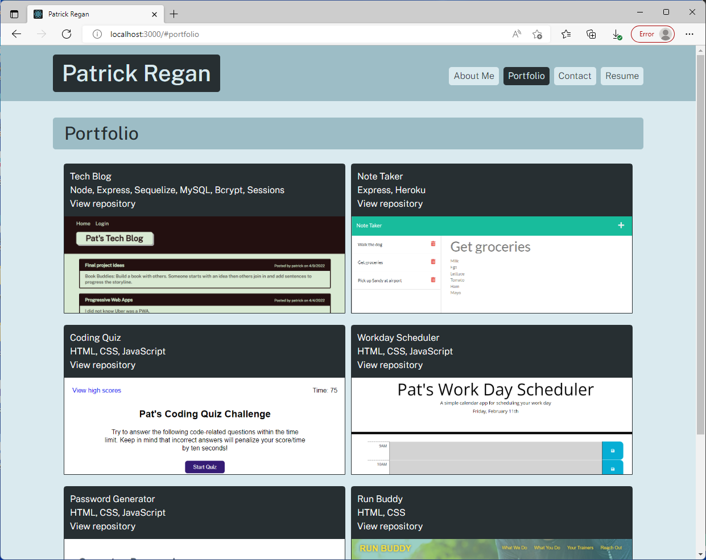

# Pat's React Portfolio

## Description

  - This project is my portfolio using React so that it is a Single Page Application (SPA).
  - I wanted to show that I could create a single page application with React.
  - I built this not only to use React, but to update my portfolio and make it look better from the previous portfolio and I added my resume.
  - This portfolio is a single page application so the user stays on one page.
  - I learned how to use React to create JSX components.

## Table of Contents

  - [Installation](#installation)
  - [Usage](#usage)
  - [Screenshot](#screenshot)
  - [License](#license)
  - [Contributing](#contributing)
  - [Questions](#questions)

## Installation

  - Clone the project from https://github.com/patrickaregan/pats-react-portfolio.git.

## Usage

  - From the root directory run `npm i` to install dependencies then run `npm start`.
  - View online at https://patrickaregan.github.io/pats-react-portfolio/.

## Screenshot

## License

  - MIT

## Contributing

  - My contribution rule is to treat others with respect and if you see any violations please contact me at my email below.  
  

## Questions

- [GitHub Profile](https://github.com/patrickaregan)
- If you have additional questions please email me at patrickaregan@gmail.com

